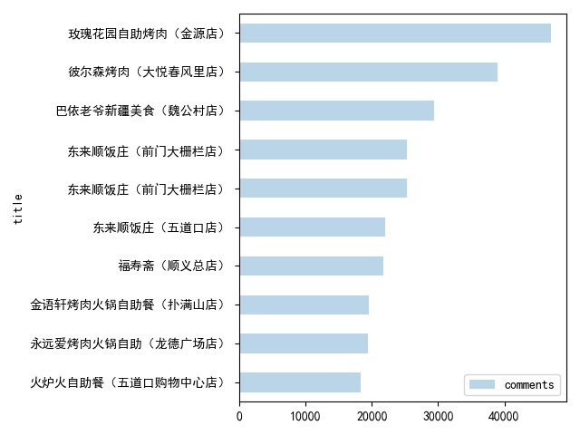

##  美团（美食）店铺信息爬虫

&emsp; 通过接口抓取美团美食店铺信息，并做相关的数据分析。

## 环境依赖

```python
pip3 install -r requirements.txt
```

## 解释说明

1.  接口动态参数：uuid,  _token, cookie
2.  接口参数 uuid 需要不定时从网页源码获取 ，否则_token 的 uuid 就会失效。
3.  接口 _token 参数加密：二进制压缩、Base64 编码， 解密：Base64 解码、二进制解压。另外、生成 token 的 sign 参数加密解密过程与 _token 相同。
4.  接口cookie 参数需要从pc浏览器端登录后获取

## 运行

切换至 meituan 文件夹的根目录执行：

```
# pip3 install -r configs/requirements.txt
python common.py
python meituan.py
```

## 数据分析

- 美食店铺名称词云

- 北京美食店铺排行榜前10名( 仅限美团数据 ) 



- MySql 数据

另外，还做了美食店铺评分占比、人均用餐价与评论数量的相关联性分析。

## 公告

**本代码仅作学习交流，切勿用于商业用途，否则后果自负。若涉及美团侵权，请与我联系，会尽快处理。**

