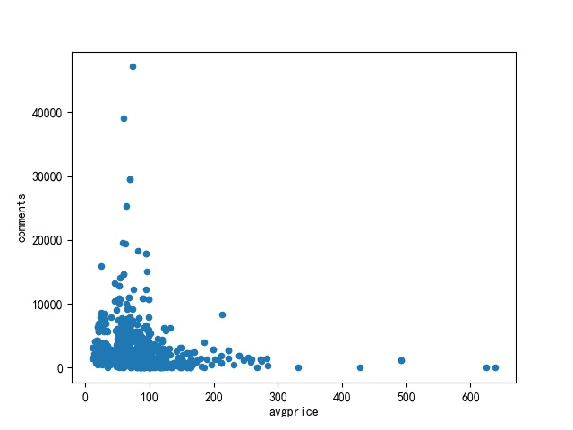

##  美团（美食）店铺信息爬虫

&emsp; 通过接口抓取美团美食店铺信息，并做相关的数据分析。

## 项目结构
```html
.
├── README.md
├── common.py
├── configs
│   ├── config.py
│   ├── parse.py
│   ├── requirements.txt
│   ├── token_.py
│   ├── utils
│   │   ├── br.json
│   │   ├── cities.json
│   │   ├── ua.log
│   │   └── uuid.log
│   ├── view
│   │   ├── FZSTK.TTF
│   │   ├── db.jpg
│   │   ├── jing.jpeg
│   │   ├── key.png
│   │   ├── pricom.jpg
│   │   ├── ratio.jpg
│   │   ├── title.txt
│   │   └── top10.jpg
│   └── visual.py
├── meituan.py
```

## 主要实现过程
1. 组装token、cookie、ua等基础参数
2. 通过requests获取数据
3. 解析json数据
4. 保存数据至mysql数据库
5. 使用matplotlib进行可视化分析

## 环境依赖

```python
pip3 install -r requirements.txt
```

## 解释说明

1.  接口动态参数：uuid,  _token, cookie
2.  接口参数 uuid 需要不定时从网页源码获取 ，否则_token 的 uuid 就会失效。
3.  接口 _token 参数加密：二进制压缩、Base64 编码， 解密：Base64 解码、二进制解压。另外、生成 token 的 sign 参数加密解密过程与 _token 相同。
4.  接口cookie 参数需要从pc浏览器端登录后获取

## 运行

切换至 meituan 文件夹的根目录执行（运行之前请确保已经安装了相关模块及数据库）：

```python
# pip3 install -r configs/requirements.txt
python common.py
python meituan.py
```

## 数据分析展示

- 美食店铺名称词云
  

- 北京美食店铺排行榜前10名( 仅限美团数据 )
  

- 店铺价格与评论数量的关联性
  

- 美食店铺各评分占比
  

- MySql 数据
  
  
## 公告

**本代码仅作学习交流，切勿用于商业用途，否则后果自负。若涉及美团侵权，请与我联系，会尽快处理。**

